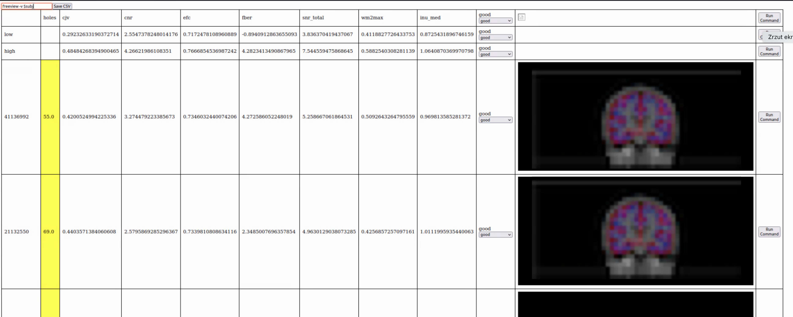
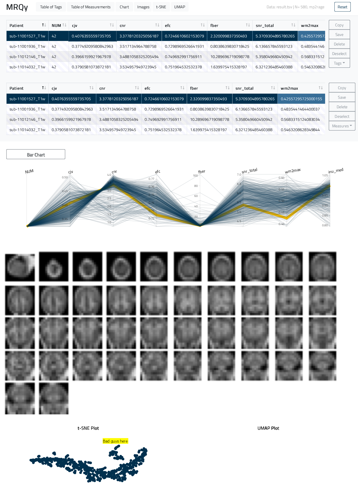

# Quality control tools for MRI

## table viewer
Load your CSV table and explore it with your web browser. Scroll line by line, provide notes using the scroll-down menu, and save the table as a new, evaluated version.

### Run with: `python -m http.server --cgi` and go to [localhost:8000](localhost:8000)

### Hints:
- I provide JavaScript code to read data.csv table, following the structure outlined in data.csv.example.
- The original table is not modified! Utilize the save button to persist your changes.
- Input your own command into a text field for execution on each table row, for example: `freeview -v $SUBJECTS_DIR/$subj/mri/T1w.mgz`. You must use $subj within Your command.
- Rows labeled "low" and "high" serve to define lower and upper thresholds. Values outside these limits will be colored yellow.
- In the last column, images named the same as the index column ({subj}.jpg) will be loaded from the `./imgs` directory.

### Example for group_bold.tsv (mriqc for BOLD images):
1. Check what columns are available and their indices ``awk -F'\t' 'NR==1 {for(i=1; i<=NF; i++) print i". " $i}' group_bold.tsv ``
2. Export those columns to a new CSV file ``cut -f 1,12,20,45 group_bold.tsv | tr '\t' ',' > data.csv``
3. (Optional) Add lower and upper bounds for cell colouring. Manually add two lines (copy and modify existing ones), rename them to 'low' and 'high' and modify respective values.
4. Run python server ``python -m http.server --cgi`` and go to [localhost:8000](localhost:8000)
5. (Optional) Use this command to open specific reports using "Run Command" button ``open -a Safari file:///Volumes/data/mriqc/$subj.html``

## mriqc2mrqy

`Now I prefer table_viewer (above) than MRQy but I leave it here.`

I offer a converter that reads the output of the mriqc app (group_T1w.csv) and enhances its visualization using MRQy (https://github.com/ccipd/MRQy). The 'html2pngs' script exports graphics saved in mriqc HTML files. Subsequently, 'mriqc2mrqy' extracts selected columns and generates TSNE and UMAP plots. Utilize the original MRQy GUI to read and display the results.

Todo:
- add some mods to MRQy for better viewing